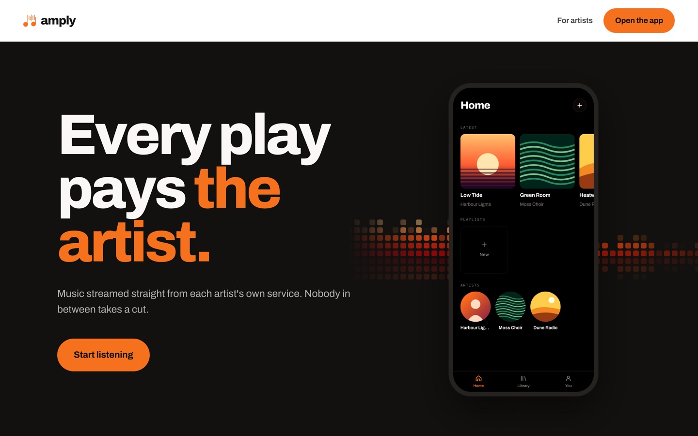
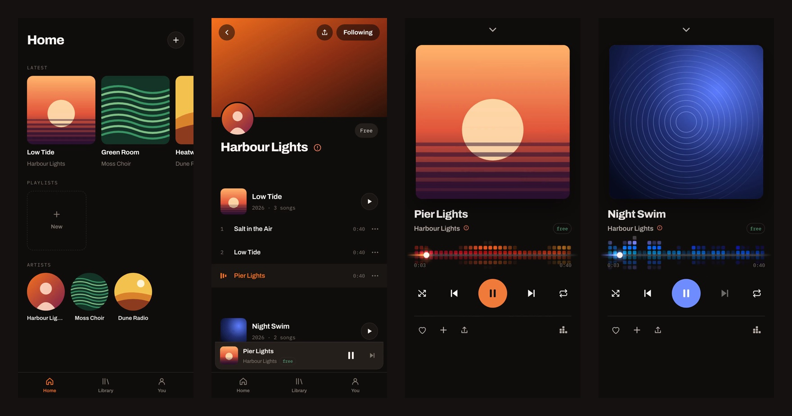

<p align="center">
  
</p>

<h1 align="center">Amply</h1>

<p align="center">
  Artists host their own music, set their own prices, and are paid directly by the people who listen.<br>
  <a href="https://amply.stream"><strong>amply.stream</strong></a> · <a href="https://amply.stream/app/">Open the app</a>
</p>



There is no company in the middle, and nothing to sell, acquire, or shut down.
**Amply takes 0%.** Not a reduced rate: there is no mechanism by which it could take anything.



---

## About this project

I came up with the idea for Amply about two years ago, before I knew how to code. Streaming
platforms pay artists a fraction of a cent per play, and I wanted to see if the platform could
be removed from the equation entirely.

This is the third version. The first was a conventional backend on AWS (Lambda, S3, DynamoDB),
with the platform storing every artist's music. Building it made the problem obvious: whoever
hosts the music is in control of it, and can always take a cut. The second iteration moved
toward artists owning their storage. This version goes all the way, and most of my work went
into the architecture:

- **Every artist runs their own node** in their own Cloudflare account. Amply never holds their
  audio, their credentials, or their money.
- **A manifest format** (think RSS for music) is the only contract between an artist's node and
  any listener app, so anyone can build a client.
- **Setup without standing access.** Onboarding uses OAuth with PKCE for a single flow and never
  keeps a token. A stateless relay handles the one CORS problem this creates.
- **Sign-in on the artist's node** goes through Cloudflare Access with an emailed one-time code,
  verified inside the Worker rather than trusted from the edge.

The implementation was written with heavy use of Claude Code. I designed the product, the
architecture and the trust model, and directed and reviewed the implementation.

## Tech stack

| Area | Tools |
|---|---|
| Artist node and relay | Cloudflare Workers, R2, D1, Cloudflare Access, TypeScript |
| Editor and listener app | Preact, esbuild, PWA (service worker, installable) |
| Setup flow | OAuth 2.0 with PKCE, Cloudflare API |
| Spec | JSON manifest with a zero-dependency validator |
| Hosting | Cloudflare Pages |

---

## How it works

An artist connects their **own** Cloudflare account at [amply.stream](https://amply.stream).
Setup creates storage, a small Worker, a public address and an editor, all inside their
account, in their name, that they log into.

Their node then serves everything a listener ever sees: the page, the artwork, the audio.
It publishes a **manifest**, a JSON file listing tracks, prices and a payment destination.

Listeners follow an artist by adding that link. There is no directory, no search and no
algorithm, because deciding who gets seen is the thing this exists to avoid.

```
 artist's Cloudflare account                       listener
┌──────────────────────────────┐
│  node (Worker)               │   manifest.json   ┌──────────────┐
│   ├─ artist page             │ ────────────────▶ │  Amply app   │
│   ├─ manifest + audio (R2)   │   audio, artwork  │  (PWA)       │
│   └─ editor, behind Access   │ ────────────────▶ └──────┬───────┘
└──────────────────────────────┘                          │
              ▲                                           │ payment
              │ one-time setup (PKCE)                     ▼
       amply.stream + relay                         straight to artist
```

## What Amply does not do

These are properties of the architecture, not promises:

- **Hosts no audio.** It is on infrastructure the artist owns and pays for.
- **Operates no editor.** Artists manage their music on their own node, behind Cloudflare
  Access, signing in with a code emailed to them. There is no hosted copy.
- **Keeps no credential.** Setup never requests `offline_access` and never accepts a refresh
  token. Access to an artist's account lasts for one flow and is then gone for good.
- **Stores nothing.** No accounts, no database, no analytics, no record that an artist
  exists. Nodes are found by listing an account, not by looking anyone up.
- **Takes no cut.** Payments go from listener to artist. Amply is not in the transaction.

## Verifying those claims

They are only worth something if you can check them, so here is where to look:

| Claim | Where |
|---|---|
| No standing access to artist accounts | [`site/js/pkce.js`](site/js/pkce.js), and enforced again in the relay |
| Nothing is stored or logged | [`relay/src/index.ts`](relay/src/index.ts): no storage bindings at all, `observability` off |
| The relay cannot be used as a general proxy | Same file: an exact method-and-path allowlist |
| Only a one-time PIN provider can be created | Same file: the request body is inspected, not just the path |
| The node has no write path without Access | [`node/src/index.ts`](node/src/index.ts), and it fails closed with no configuration |
| Sign-in cannot be forged | [`node/src/access.ts`](node/src/access.ts): the assertion is verified in the Worker, not assumed from the edge |

## Repository layout

```
spec/     the manifest specification, a reference file, and a validator
node/     the Worker an artist runs in their own Cloudflare account
manage/   the editor, served from the artist's own node
relay/    a stateless CORS relay, used only during setup
site/     the deploy flow
```

## Building

```
npm run build             # every artifact the site serves
npm run check             # build, validate the spec, typecheck both Workers
npm run test:node <url>   # 16 conformance checks against any node
```

Three files in `site/` are compiled from elsewhere in the repo; see [BUILD.md](BUILD.md).
Deploying without building ships stale copies, including, once, a Worker that would have
left artists with an editor that could not save.

## For artists

**Use only music you own outright.** No covers, no uncleared samples. Two separate
questions matter and both must be yes: do you own the recording, and are you free to
distribute it yourself? An exclusive distribution deal can prevent self-hosting a recording
you fully own.

Your music lives on your infrastructure, so takedown notices come to you, not to Amply,
which has no copy and no ability to remove anything.

## Licence

[Apache 2.0](LICENSE). The name and logo are **not** licensed with the code; see
[NOTICE](NOTICE).
